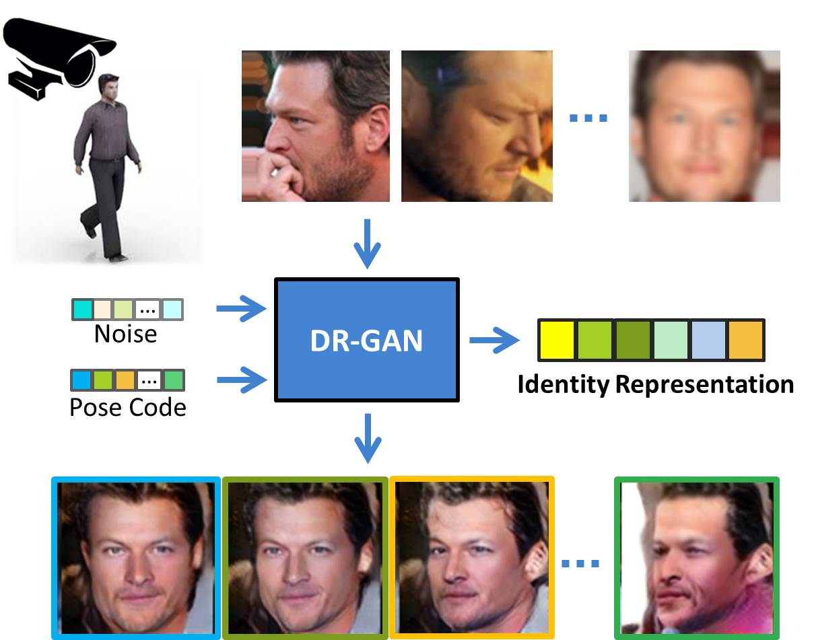

# Disentangled Representation Learning GAN for Pose-Invariant Face Recognition (DR-GAN)
### [[Project page]](http://cvlab.cse.msu.edu/project-dr-gan.html)   [[CVPR'17 Paper]](http://cvlab.cse.msu.edu/pdfs/Tran_Yin_Liu_CVPR2017.pdf) [[PAMI'18 Paper]](http://cvlab.cse.msu.edu/pdfs/Tran_Yin_Liu_PAMI2018.pdf)




## Library requirements

* Tensorflow


## Data

[VGG2](http://www.robots.ox.ac.uk/~vgg/data/vgg_face2/data_infor.html)

Please create txt files with each line in the form <image path>;<person_id> 

## Run the code

Pretraining

```bash
pretrain.sh
```


Finetunning

```bash
train_DRGAN_multi.sh
```


## Citation

If you find this work useful, please cite our papers with the following bibtex:
```latex
@article{ tran2018representation,
  author = { Luan Tran and Xi Yin and Xiaoming Liu },
  title = { Representation Learning by Rotating Your Faces },
  booktitle = { IEEE Transactions on Pattern Analysis and Machine Intelligence },
  month = { September },
  year = { 2018 },
}
```

```latex
@inproceedings{ tran2017disentangled,
  author = { Luan Tran and Xi Yin and Xiaoming Liu },
  title = { Disentangled Representation Learning GAN for Pose-Invariant Face Recognition },
  booktitle = { In Proceeding of IEEE Computer Vision and Pattern Recognition },
  address = { Honolulu, HI },
  month = { July },
  year = { 2017 },
}
```

## Contacts

If you have any questions, feel free to drop an email to _tranluan@msu.edu_.
